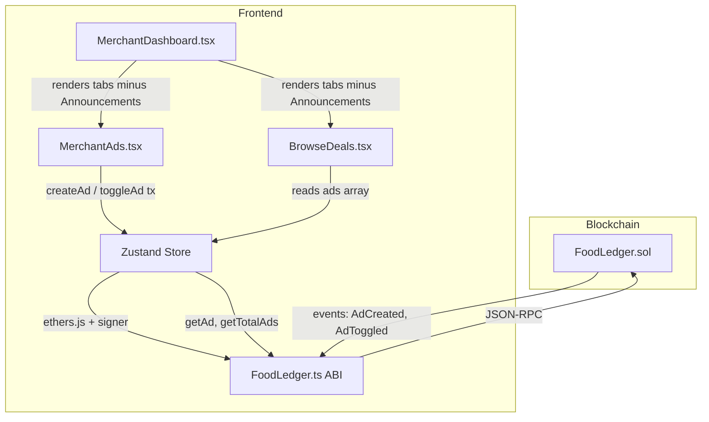

# Design Document: Blockchain Ads

## Overview

This feature migrates the advertisement system from in-memory mock data to on-chain storage within the existing FoodLedger smart contract. The change touches four layers:

1. **Smart Contract** – New `Ad` struct, storage mappings, and functions (`createAd`, `toggleAd`, `getAd`, `getTotalAds`, `getMerchantAds`) added to `FoodLedger.sol`.
2. **Frontend ABI** – `src/contracts/FoodLedger.ts` updated with new function and event signatures.
3. **State Management** – `src/store/index.ts` replaces mock ad data with on-chain reads/writes.
4. **UI Components** – `MerchantAds.tsx` sends blockchain transactions; `BrowseDeals.tsx` reads on-chain ads; `MerchantDashboard.tsx` drops the Announcements tab.

No new contracts are deployed. The existing `FoodLedger` contract is extended in-place.

## Architecture



### Key Design Decisions

1. **Extend FoodLedger rather than new contract** – Ads are tightly coupled to merchants and plans already managed by FoodLedger. A separate contract would require cross-contract calls and complicate deployment. Extending keeps the single-contract model consistent with the rest of the app.

2. **planId stored on-chain** – Linking ads to plans on-chain enables future on-chain validation (e.g., only advertise active plans). For now it's informational.

3. **No imageUrl on-chain** – Storing image URLs on-chain is wasteful. The current mock `imageUrl` field is unused (always `""`). The on-chain Ad struct omits it. If images are needed later, IPFS hashes can be added.

4. **Load pattern: iterate 0..totalAds** – Matches the existing pattern used for plans and purchases. Simple and consistent.

## Components and Interfaces

### Smart Contract Additions (FoodLedger.sol)

New public functions:

| Function                                                     | Access                       | Description                          |
| ------------------------------------------------------------ | ---------------------------- | ------------------------------------ |
| `createAd(string title, string description, uint256 planId)` | `onlyMerchant`               | Creates a new ad, emits `AdCreated`  |
| `toggleAd(uint256 adId)`                                     | `onlyMerchant` (owner of ad) | Flips `isActive`, emits `AdToggled`  |
| `getAd(uint256 adId) → Ad`                                   | `view`                       | Returns ad struct                    |
| `getTotalAds() → uint256`                                    | `view`                       | Returns `nextAdId`                   |
| `getMerchantAds(address) → uint256[]`                        | `view`                       | Returns array of ad IDs for merchant |

New events:

| Event       | Fields                                                         |
| ----------- | -------------------------------------------------------------- |
| `AdCreated` | `uint256 indexed adId, address indexed merchant, string title` |
| `AdToggled` | `uint256 indexed adId, bool isActive`                          |

### Frontend ABI (src/contracts/FoodLedger.ts)

Add human-readable ABI strings for the five new functions and two new events.

### Store (src/store/index.ts)

- New helper `loadAllAdsFromChain()` – iterates `0..getTotalAds()`, builds `Ad[]`.
- `createAd` action – calls contract `createAd` with signer, then reloads.
- `toggleAd` action – calls contract `toggleAd` with signer, then reloads.
- `loadOnChainData` – add `loadAllAdsFromChain()` to the parallel load.
- Remove `mockAds` import and initial `ads: mockAds`.

### UI Changes

- **MerchantDashboard.tsx** – Remove the Announcements tab entry and its import.
- **MerchantAds.tsx** – Update `handleCreate` to call the async store `createAd` (which now sends a tx). Add loading/error state. Pass `planId` as the on-chain plan index (strip `plan-` prefix).
- **BrowseDeals.tsx** – No structural changes needed; it already reads `ads` from the store. The store will now populate `ads` from chain data instead of mocks.

## Data Models

### On-Chain: Ad Struct (Solidity)

```solidity
struct Ad {
    uint256 id;
    address merchant;
    string title;
    string description;
    uint256 planId;
    bool isActive;
    uint256 createdAt;
}
```

Storage:

```solidity
mapping(uint256 => Ad) public ads;
mapping(address => uint256[]) public merchantAds;
uint256 public nextAdId;
```

### Frontend: Ad Interface (TypeScript)

The existing `Ad` type in `src/types/index.ts` will be updated to drop `imageUrl` (unused) and add `merchantName` for display:

```typescript
export interface Ad {
  id: string;
  merchantId: string;
  merchantName: string;
  title: string;
  description: string;
  planId: string;
  isActive: boolean;
  createdAt: string;
}
```

### Mapping: Chain → Frontend

| Chain field      | Frontend field | Transform                                          |
| ---------------- | -------------- | -------------------------------------------------- |
| `ad.id`          | `id`           | `"ad-${id}"`                                       |
| `ad.merchant`    | `merchantId`   | `.toLowerCase()`                                   |
| (lookup)         | `merchantName` | `contract.getUser(merchant).name`                  |
| `ad.title`       | `title`        | as-is                                              |
| `ad.description` | `description`  | as-is                                              |
| `ad.planId`      | `planId`       | `"plan-${planId}"`                                 |
| `ad.isActive`    | `isActive`     | as-is                                              |
| `ad.createdAt`   | `createdAt`    | `new Date(Number(createdAt) * 1000).toISOString()` |

## Correctness Properties

_A property is a characteristic or behavior that should hold true across all valid executions of a system — essentially, a formal statement about what the system should do. Properties serve as the bridge between human-readable specifications and machine-verifiable correctness guarantees._

### Property 1: Ad creation round-trip

_For any_ valid title (non-empty string), description (string), and planId (uint256), when a merchant calls `createAd`, reading back the ad via `getAd` should return a struct where `title`, `description`, and `planId` match the inputs, `merchant` equals the caller, `isActive` is `true`, `createdAt` is the block timestamp, and an `AdCreated` event is emitted with the correct ad ID, merchant address, and title.

**Validates: Requirements 2.1, 2.4, 2.8**

### Property 2: Ad tracking invariants

_For any_ sequence of `createAd` calls across any number of merchants, `getTotalAds()` should equal the total number of ads created, and for each merchant, `getMerchantAds(merchant)` should return exactly the set of ad IDs that merchant created, in creation order.

**Validates: Requirements 2.3, 2.11**

### Property 3: Non-merchant cannot create ads

_For any_ account that does not have the Merchant role (admin, customer, or unregistered), calling `createAd` should revert.

**Validates: Requirements 2.5**

### Property 4: Toggle flips isActive

_For any_ ad owned by a merchant, calling `toggleAd` should flip the `isActive` flag (true→false or false→true), and an `AdToggled` event should be emitted with the ad ID and the new `isActive` value. Calling `toggleAd` twice should restore the original state (round-trip).

**Validates: Requirements 2.6, 2.9**

### Property 5: Non-owner cannot toggle ads

_For any_ ad and any merchant who is not the ad's creator, calling `toggleAd` on that ad should revert.

**Validates: Requirements 2.7**

### Property 6: Active ad filtering and display

_For any_ set of ads with mixed `isActive` states, the customer-facing display should include exactly the ads where `isActive` is `true`, and each displayed ad should contain its title, description, and the associated merchant's name.

**Validates: Requirements 5.2, 5.3**

### Property 7: Store ad loading round-trip

_For any_ set of ads created on-chain, calling `loadAllAdsFromChain()` should produce an `Ad[]` array where each entry has correctly mapped fields: `id` prefixed with `"ad-"`, `merchantId` lowercased, `merchantName` from the user lookup, `planId` prefixed with `"plan-"`, and `createdAt` converted from unix timestamp to ISO string.

**Validates: Requirements 6.4**

## Error Handling

### Smart Contract Layer

| Scenario                                           | Handling                                                                                                |
| -------------------------------------------------- | ------------------------------------------------------------------------------------------------------- |
| Non-merchant calls `createAd`                      | `require` reverts with "Not merchant" (existing `onlyMerchant` modifier)                                |
| Merchant calls `toggleAd` on another merchant's ad | `require` reverts with "Not your ad"                                                                    |
| `getAd` called with non-existent ID                | Returns zero-initialized struct (Solidity default). Frontend checks `merchant == address(0)` to detect. |

### Frontend / Store Layer

| Scenario                                            | Handling                                                                                          |
| --------------------------------------------------- | ------------------------------------------------------------------------------------------------- |
| `createAd` transaction rejected by user in MetaMask | Catch error, set `isLoading: false`, log to console                                               |
| `createAd` transaction reverts on-chain             | Catch error, display alert with revert reason, set `isLoading: false`                             |
| `toggleAd` transaction fails                        | Catch error, log, no state change (optimistic update not used)                                    |
| Contract not deployed (chain reset)                 | Existing `isContractDeployed()` check handles this; ad loading returns empty array                |
| `loadAllAdsFromChain` fails mid-iteration           | Catch per-ad errors (like existing plan loading pattern), skip failed ads, return partial results |

## Testing Strategy

### Unit Tests (Hardhat / Chai)

Specific examples and edge cases for the smart contract:

- Creating an ad with empty title (should still succeed — no on-chain validation for empty strings, but good to document behavior)
- Toggle ad twice returns to original state (specific example of Property 4)
- Admin cannot create ads (specific example of Property 3)
- Customer cannot create ads (specific example of Property 3)
- Unregistered account cannot create ads (specific example of Property 3)
- Merchant A cannot toggle Merchant B's ad (specific example of Property 5)
- `getAd` on non-existent ID returns zero struct
- Event field values match expected for a specific createAd call

### Property-Based Tests (Hardhat + fast-check)

Each correctness property is implemented as a single property-based test using `fast-check` for input generation, running a minimum of 100 iterations.

The `fast-check` library will be added as a dev dependency to the `backend/` package. Each test will be tagged with a comment referencing the design property:

```
// Feature: blockchain-ads, Property 1: Ad creation round-trip
```

Property tests to implement:

1. **Ad creation round-trip** – Generate random (title, description, planId) tuples, call `createAd`, read back via `getAd`, assert all fields match. _(Feature: blockchain-ads, Property 1)_
2. **Ad tracking invariants** – Generate a random sequence of createAd calls from multiple merchants, verify `getTotalAds` and `getMerchantAds` return correct values. _(Feature: blockchain-ads, Property 2)_
3. **Non-merchant access control** – Generate random role assignments (admin/customer/none), attempt `createAd`, assert revert. _(Feature: blockchain-ads, Property 3)_
4. **Toggle round-trip** – Generate random ads, toggle N times, verify final `isActive` equals `N % 2 == 0`. _(Feature: blockchain-ads, Property 4)_
5. **Non-owner toggle revert** – Generate two merchants with ads, cross-toggle, assert revert. _(Feature: blockchain-ads, Property 5)_
6. **Active ad filtering** – Generate random ads with random isActive states, filter, verify only active ads pass through. _(Feature: blockchain-ads, Property 6)_
7. **Store mapping round-trip** – Generate random on-chain ad data, run through the mapping function, verify field transformations are correct. _(Feature: blockchain-ads, Property 7)_

### Test Configuration

- Property tests: minimum 100 iterations each (configurable via `fc.assert(..., { numRuns: 100 })`)
- Smart contract tests run via `npx hardhat test` in the `backend/` directory
- Frontend component tests (for Properties 6, 7) can use Vitest + fast-check
- Add `fast-check` to `backend/devDependencies` for contract property tests
